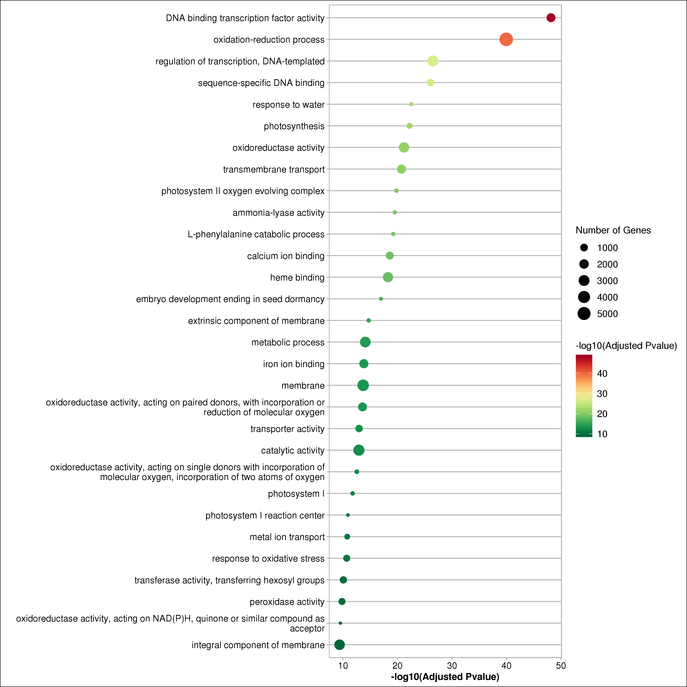

## RNAseq

### [参考基因组文件准备](prepare)

#### gene_len_from_gtf.py

```bash
# 生成基因长度中位数
python gene_len_from_gtf.py \
    --gtf genome.gtf \
    --output gene_length.txt
```

#### split_gtf_by_type.py

```bash
# 按照 ensembl gene_biotype 拆分 gtf 文件
python split_gtf_by_type.py \
	--gtf genome.gtf \
	--outdir split_gtf_dir 	
```

### [富集分析](enrichment)

#### enrich_scatter.R

GO (goseq) / KEGG (KOBAS 2.0) 分析结果散点图


```bash

Rscript enrich_scatter.R \
    --enrich_file xxx.enrichment.txt \ # 输出 xxx.enrichment.scatter_plot.(png, pdf)


```



