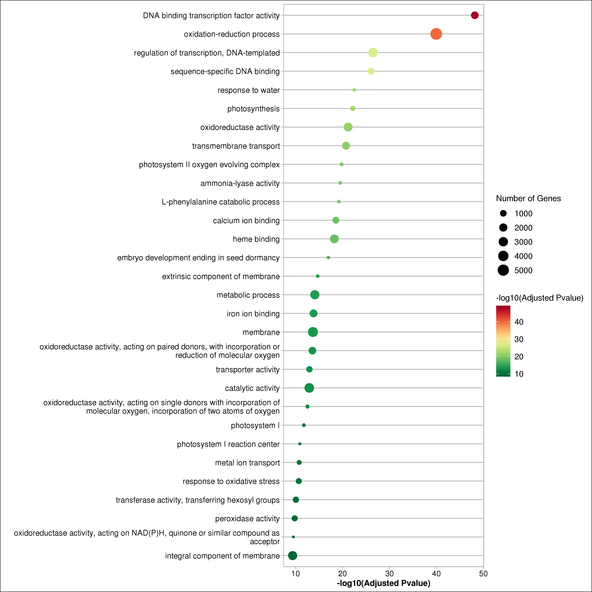

## Enrichment

存放与富集分析相关脚本

### plot

#### enrich_scatter.R

GO (goseq) / KEGG (KOBAS 2.0) 分析结果散点图


```bash

Rscript enrich_scatter.R \
    --enrich_file xxx.enrichment.txt \ # 输出 xxx.enrichment.scatter_plot.(png, pdf)


```

example:

